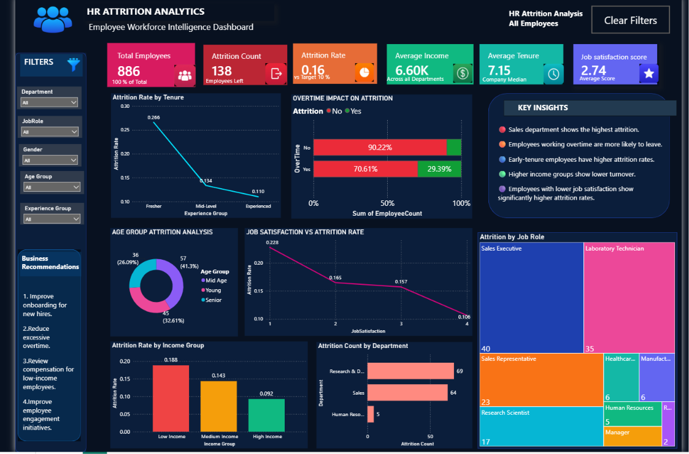

# 📊 HR Attrition Analysis Dashboard

A complete end-to-end Data Analytics project that analyzes employee attrition using **Python, SQL, and Power BI**. The project identifies the major factors contributing to employee turnover and provides business recommendations to improve employee retention.

---

## 📌 Project Overview

Employee attrition is one of the biggest challenges faced by organizations because it increases recruitment costs, training expenses, and productivity loss.

This project analyzes HR employee data to discover the key drivers behind attrition and presents the findings through an interactive Power BI dashboard.

---

## 🎯 Business Objective

The primary objective of this project is to answer the following business questions:

- Why are employees leaving the organization?
- Which employees have the highest attrition risk?
- Which departments and job roles require immediate attention?
- Which workplace factors influence employee retention?
- What actions can reduce employee attrition?

---

## 🛠️ Tools & Technologies

| Tool | Purpose |
|------|---------|
| Python | Data Cleaning & Analysis |
| Pandas | Data Manipulation |
| NumPy | Numerical Operations |
| Matplotlib | Data Visualization |
| SQL | Business Query Analysis |
| Power BI | Interactive Dashboard |
| Jupyter Notebook | Python Development |

---

## 📂 Project Workflow

Raw Dataset

⬇️

Data Cleaning using Python

⬇️

Business Analysis using SQL

⬇️

Interactive Dashboard in Power BI

⬇️

Business Insights & Recommendations

---

## 📈 Dashboard Highlights

The Power BI dashboard provides interactive analysis on:

- Overall Attrition Rate
- Attrition by Department
- Attrition by Job Role
- Attrition by Income Group
- Attrition by Overtime
- Attrition by Experience
- Job Satisfaction Analysis
- Work-Life Balance Analysis
- Promotion Gap Analysis

---

## 🔍 Key Insights

✔ Overall Attrition Rate is approximately **16%**

✔ Employees working overtime are significantly more likely to leave.

✔ Low-income employees have the highest attrition rate.

✔ Freshers leave more frequently than experienced employees.

✔ Sales and Human Resources departments experience higher employee turnover.

✔ Sales Representatives and Laboratory Technicians have the highest attrition among job roles.

✔ Employees with lower job satisfaction show higher attrition.

✔ Poor work-life balance contributes to employee turnover.

✔ Longer promotion gaps increase the likelihood of attrition.

---

## 💡 Business Recommendations

- Reduce excessive overtime through better workload planning.
- Review compensation policies for low-income employees.
- Strengthen onboarding and mentoring programs for freshers.
- Improve employee engagement initiatives.
- Provide transparent promotion and career growth opportunities.
- Focus retention strategies on high-risk departments and job roles.

---

## 📁 Repository Contents

| File | Description |
|------|-------------|
| HR_Attrition.pbix | Power BI Dashboard |
| HR_Attrition.ipynb | Python Data Analysis |
| HR_Attrition_SQL_Queries.sql | SQL Queries |
| HR_Attrition_Report.pdf | Business Report |
| HR_Employee_Attrition.csv | Dataset |

---

## 🚀 Skills Demonstrated

- Data Cleaning
- Exploratory Data Analysis (EDA)
- SQL Query Writing
- Dashboard Design
- Data Visualization
- Business Intelligence
- Business Storytelling
- Business Recommendations

---

## 📊 Dashboard Preview

## 📚 Dataset

This project uses the **HR Analytics Employee Attrition & Performance** dataset, a widely used dataset for HR analytics and employee attrition analysis.

The dataset contains employee information such as:

- Age
- Department
- Job Role
- Monthly Income
- Years at Company
- Overtime
- Job Satisfaction
- Work-Life Balance
- Performance Rating
- Attrition Status

The dataset is used for educational and analytical purposes to identify the factors influencing employee attrition.

---

## 👨‍💻 Author

**Sunny Verma**

Aspiring Data Analyst

**Skills:** Python • SQL • Power BI • Excel • Pandas • Data Visualization

---

⭐ If you found this project useful, feel free to give it a star.
